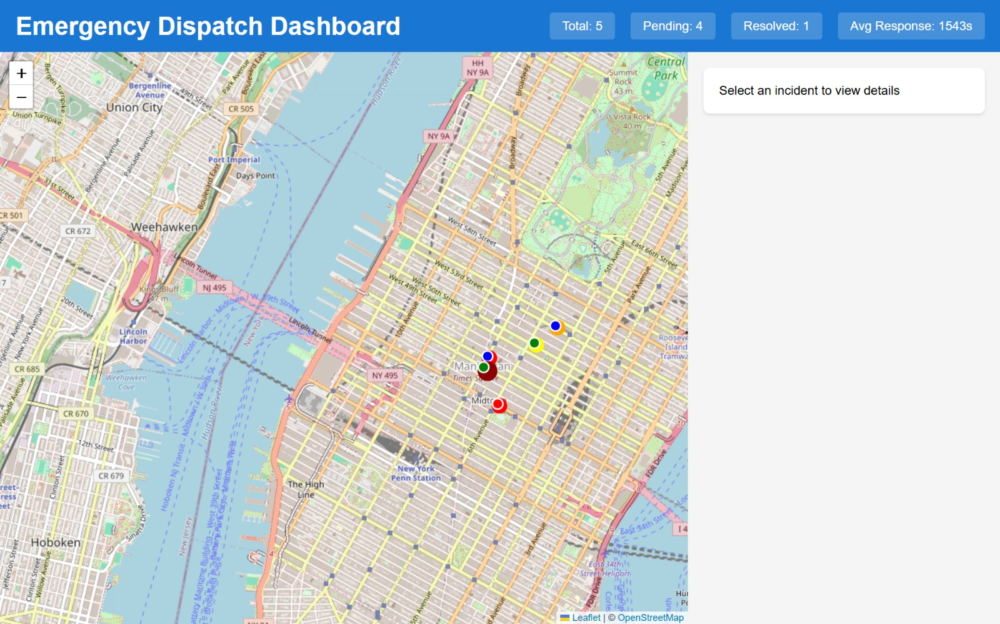
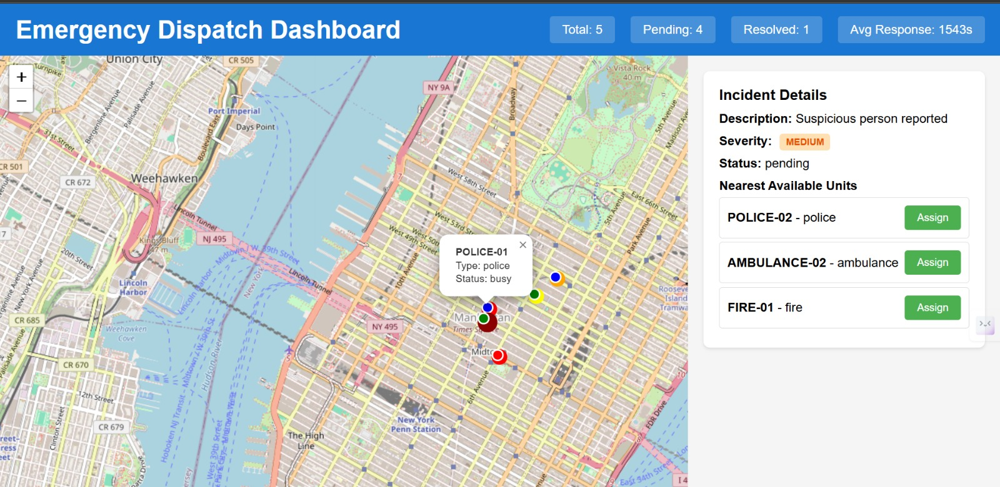
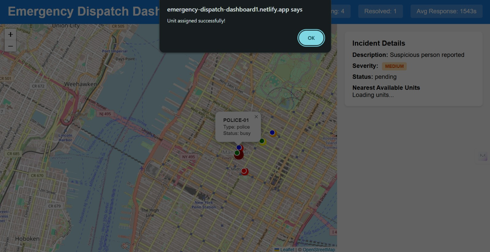

# 🚨 Emergency Dispatch Dashboard

AI-powered emergency dispatch system with real-time unit tracking and intelligent incident severity classification.

[](https://YOUR-NETLIFY-URL.netlify.app)
[](https://github.com/YOUR_USERNAME/emergency-dispatch)

---

## 🔗 Live Links

- **🌐 Frontend**: [https://emergency-dispatch-dashboard1.netlify.app]
- **⚙️ Backend API**: [https://emergency-dispatch-api.onrender.com]
- **📂 GitHub Repository**: [https://github.com/Neha-Erigidindla/emergency-dispatch]

---

## 📸 Screenshots

### Dashboard Overview

*Real-time map showing active incidents and emergency units*

### AI-Powered Incident Classification

*Claude AI automatically analyzes and classifies incident severity*

### Smart Unit Assignment

*Geospatial queries find nearest available units instantly*

### Performance Analytics

*Track response times and system efficiency*

---

## 🎥 Demo Video

[](YOUR_YOUTUBE_LINK)

**Watch the full walkthrough**: [YouTube Demo](YOUR_YOUTUBE_LINK)

---

## ✨ Key Features

- 🗺️ **Interactive Map**: Real-time visualization of emergency units and incidents using Leaflet.js
- 🤖 **AI Classification**: Claude AI automatically classifies incident severity (Low, Medium, High, Critical)
- 📍 **Geospatial Queries**: MongoDB geospatial indexes for instant nearest unit lookup
- 📊 **Performance Metrics**: Real-time tracking of response times and system efficiency
- 🚨 **One-Click Dispatch**: Assign nearest available units with a single click
- ⚡ **Live Updates**: Real-time status updates for incidents and unit availability
- 📱 **Responsive Design**: Works seamlessly on desktop and mobile devices

---

## 🛠️ Tech Stack

### Frontend
- **React.js** - UI framework
- **Leaflet.js** - Interactive mapping
- **Axios** - API communication
- **CSS3** - Styling and animations

### Backend
- **Node.js** - Runtime environment
- **Express.js** - Web framework
- **MongoDB Atlas** - Database with geospatial indexing
- **Mongoose** - ODM for MongoDB

### AI & APIs
- **Anthropic Claude API** - Incident severity classification
- **RESTful API** - Communication between frontend and backend

### Deployment
- **Netlify** - Frontend hosting
- **Render** - Backend hosting
- **MongoDB Atlas** - Cloud database

---

## 📋 Prerequisites

Before running this project, make sure you have:

- **Node.js** (v16 or higher) - [Download here](https://nodejs.org/)
- **MongoDB Atlas Account** - [Sign up here](https://www.mongodb.com/cloud/atlas)
- **Anthropic API Key** - [Get your key here](https://console.anthropic.com/)
- **Git** - [Download here](https://git-scm.com/)

---

## 🚀 Installation & Setup

### 1️⃣ Clone the Repository
```bash
git clone https://github.com/Neha-Erigidindla/emergency-dispatch.git
cd emergency-dispatch
```

### 2️⃣ Backend Setup
```bash
cd backend
npm install
```

Create `.env` file in the `backend` folder:
```env
PORT=5000
MONGODB_URI=your_mongodb_atlas_connection_string
ANTHROPIC_API_KEY=your_anthropic_api_key
NODE_ENV=development
```

**Get your MongoDB URI:**
1. Go to MongoDB Atlas Dashboard
2. Click "Connect" on your cluster
3. Choose "Connect your application"
4. Copy the connection string

**Get your Anthropic API Key:**
1. Go to [console.anthropic.com](https://console.anthropic.com/)
2. Navigate to API Keys
3. Create a new key

### 3️⃣ Frontend Setup
```bash
cd ../frontend
npm install
```

Create `.env` file in the `frontend` folder:
```env
REACT_APP_API_URL=http://localhost:5000/api
```

### 4️⃣ Generate Sample Data
```bash
cd ../backend
node utils/dataGenerator.js
```

This creates:
- 20 sample incidents across a city
- 15 emergency units (ambulances, fire trucks, police)
- Geographic coordinates for realistic mapping

---

## 💻 Running Locally

### Start Backend Server
```bash
cd backend
npm start
```

✅ Server runs on `http://localhost:5000`

### Start Frontend (New Terminal)
```bash
cd frontend
npm start
```

✅ App opens on `http://localhost:3000`

---

## 📡 API Endpoints

### Incidents

| Method | Endpoint | Description |
|--------|----------|-------------|
| `GET` | `/api/incidents` | Get all incidents |
| `POST` | `/api/incidents` | Create new incident (with AI classification) |
| `GET` | `/api/incidents/nearby` | Get nearby incidents within radius |

**Example Request:**
```bash
GET /api/incidents/nearby?longitude=-122.4194&latitude=37.7749&maxDistance=5000
```

### Units

| Method | Endpoint | Description |
|--------|----------|-------------|
| `GET` | `/api/units` | Get all emergency units |
| `POST` | `/api/units` | Create/update unit location |
| `GET` | `/api/units/nearest` | Find nearest available units |

**Example Request:**
```bash
GET /api/units/nearest?longitude=-122.4194&latitude=37.7749&type=ambulance&limit=5
```

### Dispatch

| Method | Endpoint | Description |
|--------|----------|-------------|
| `POST` | `/api/dispatch/assign` | Assign unit to incident |
| `POST` | `/api/dispatch/resolve` | Mark incident as resolved |
| `GET` | `/api/dispatch/metrics` | Get performance statistics |

---

## 🌐 Deployment Guide

### Backend (Render)

1. Create account on [Render.com](https://render.com)
2. Click **"New +"** → **"Web Service"**
3. Connect your GitHub repository
4. Configure:
   - **Name**: `emergency-dispatch-api`
   - **Root Directory**: `backend`
   - **Build Command**: `npm install`
   - **Start Command**: `npm start`
   - **Instance Type**: Free

5. Add Environment Variables:
```
   MONGODB_URI = your_mongodb_connection_string
   ANTHROPIC_API_KEY = your_anthropic_api_key
   NODE_ENV = production
```

6. Click **"Create Web Service"**

### Frontend (Netlify)

1. Create account on [Netlify.com](https://netlify.com)
2. Click **"Add new site"** → **"Import an existing project"**
3. Connect your GitHub repository
4. Configure:
   - **Base directory**: `frontend`
   - **Build command**: `npm run build`
   - **Publish directory**: `frontend/build`

5. Add Environment Variable:
```
   REACT_APP_API_URL = https://your-backend-url.onrender.com/api
```

6. Click **"Deploy site"**

---

## 📖 Usage Guide

### 1. View the Dashboard
- Open the application to see the interactive map
- Red markers = Active incidents
- Blue markers = Available emergency units

### 2. Inspect an Incident
- Click on any red marker on the map
- View AI-generated severity classification
- See incident description and location details

### 3. Dispatch a Unit
- With an incident selected, click **"Find Nearest Units"**
- System uses geospatial queries to find closest available units
- Click **"Assign"** next to a unit to dispatch

### 4. Monitor Performance
- View real-time metrics:
  - Total incidents handled
  - Average response time
  - Active vs resolved incidents
  - Unit availability status

### 5. Resolve an Incident
- Click **"Resolve Incident"** when emergency is handled
- System automatically updates metrics and frees the assigned unit

---

## 📁 Project Structure
```
emergency-dispatch/
├── backend/
│   ├── models/
│   │   ├── Incident.js          # Incident schema with geospatial fields
│   │   ├── Unit.js               # Emergency unit schema
│   │   └── Dispatch.js           # Dispatch assignment schema
│   ├── routes/
│   │   ├── incidents.js          # Incident API routes
│   │   ├── units.js              # Unit management routes
│   │   └── dispatch.js           # Dispatch logic routes
│   ├── services/
│   │   └── aiClassification.js   # Claude AI integration
│   ├── utils/
│   │   └── dataGenerator.js      # Sample data generator
│   ├── server.js                 # Express app entry point
│   ├── package.json
│   └── .env                      # Environment variables
│
├── frontend/
│   ├── public/
│   │   └── index.html
│   ├── src/
│   │   ├── components/
│   │   │   ├── Map.js            # Leaflet map component
│   │   │   ├── IncidentList.js   # Incident sidebar
│   │   │   ├── UnitList.js       # Unit management panel
│   │   │   └── Metrics.js        # Performance dashboard
│   │   ├── services/
│   │   │   └── api.js            # API client with Axios
│   │   ├── App.js                # Main application
│   │   ├── App.css               # Styles
│   │   └── index.js              # React entry point
│   ├── package.json
│   └── .env                      # Frontend environment variables
│
├── screenshots/                  # Application screenshots
├── README.md                     # Project documentation
└── .gitignore                    # Git ignore rules
```

---

## 🧪 Testing the Application

### Test Incident Creation
```bash
curl -X POST http://localhost:5000/api/incidents \
  -H "Content-Type: application/json" \
  -d '{
    "description": "Medical emergency - chest pain",
    "location": {
      "type": "Point",
      "coordinates": [-122.4194, 37.7749]
    },
    "address": "123 Main St, San Francisco, CA"
  }'
```

### Test Nearest Unit Query
```bash
curl "http://localhost:5000/api/units/nearest?longitude=-122.4194&latitude=37.7749&type=ambulance&limit=3"
```

---

## 🤖 How AI Classification Works

The system uses **Claude AI** to analyze incident descriptions and assign severity levels:

1. **User creates incident** with natural language description
2. **Backend sends description** to Claude API
3. **AI analyzes** the text for:
   - Medical urgency
   - Public safety risk
   - Resource requirements
4. **Returns severity**: Low, Medium, High, or Critical
5. **System stores** classification with incident

**Example Classifications:**
- "Minor fender bender, no injuries" → **Low**
- "House fire, residents evacuated" → **High**
- "Active shooter situation" → **Critical**

---

## 📊 MongoDB Geospatial Features

### Geospatial Indexes
```javascript
// Automatically created on Unit and Incident models
location: {
  type: { type: String, default: 'Point' },
  coordinates: [Number] // [longitude, latitude]
}
```

### Nearest Unit Query
```javascript
// Find units within 5km radius, sorted by distance
Unit.find({
  location: {
    $near: {
      $geometry: { type: 'Point', coordinates: [lng, lat] },
      $maxDistance: 5000
    }
  },
  status: 'available'
})
```

---

## 🎯 Future Enhancements

- [ ] Real-time WebSocket updates for live dispatch changes
- [ ] Route optimization using Google Maps API
- [ ] SMS/Email notifications for dispatchers
- [ ] Historical data analytics and reporting
- [ ] Multi-agency coordination features
- [ ] Mobile app for field units
- [ ] Voice-to-text incident reporting
- [ ] Predictive analytics for resource allocation

---

## 🐛 Troubleshooting

### Issue: Map not loading
**Solution**: Check that `REACT_APP_API_URL` in frontend `.env` points to correct backend URL

### Issue: AI classification failing
**Solution**: Verify `ANTHROPIC_API_KEY` is set correctly in backend `.env`

### Issue: No incidents showing
**Solution**: Run `node utils/dataGenerator.js` to create sample data

### Issue: CORS errors
**Solution**: Ensure backend `cors` middleware includes your frontend URL

---

## 🤝 Contributing

Contributions are welcome! Please follow these steps:

1. Fork the repository
2. Create a feature branch (`git checkout -b feature/AmazingFeature`)
3. Commit your changes (`git commit -m 'Add some AmazingFeature'`)
4. Push to the branch (`git push origin feature/AmazingFeature`)
5. Open a Pull Request

---

## 📄 License

This project is licensed under the MIT License - see the [LICENSE](LICENSE) file for details.

---

## 👩‍💻 Author

**Neha Erigidindla**

- GitHub: [@Neha-Erigidindla]
- LinkedIn: [https://linkedin.com/in/neha-erigidindla-8000a9252]

---

## 🙏 Acknowledgments

- **Anthropic** for Claude AI API
- **Leaflet.js** for mapping library
- **MongoDB** for geospatial database capabilities
- **Render** and **Netlify** for free hosting

---

## 📞 Support

For questions or issues, please:
- Open an issue on [GitHub Issues](https://github.com/YOUR_USERNAME/emergency-dispatch/issues)
- Contact me via email: nehaerigidindla@gmail.com

---

**⭐ If you find this project helpful, please give it a star!**

---

*Built with ❤️ by Neha Erigidindla*